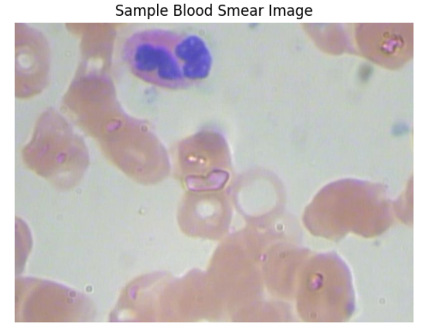
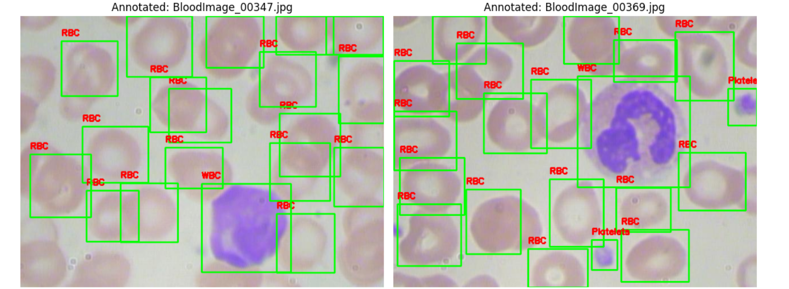
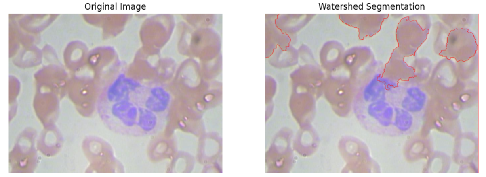

# Blood Cell Detection and Segmentation from Peripheral Smear Images

## Project Overview

**Peripheral blood smear analysis** is a critical diagnostic procedure to evaluate blood cell types and detect abnormalities such as infections, leukemia, anemia, and other hematologic disorders. Manual assessment is labor-intensive and error-prone, prompting the need for automated, reproducible systems.

This project combines **traditional image processing techniques** (e.g., Watershed Segmentation) with a **recent convolutional neural network (CNN) classifier**, trained to categorize blood cells based on their image patches. This hybrid approach automates the identification and classification of RBCs, WBCs, and Platelets from annotated peripheral blood smear images.

---

### **Situation**
Manual identification of blood cells in peripheral smears is time-consuming and requires expert knowledge. Misidentification can lead to incorrect diagnoses and poor patient outcomes.

###  **Task**
To automate the segmentation and classification of blood cells using both classical computer vision and deep learning techniques, aiding pathologists with faster and more accurate analysis.

###  **Action**

####  Dataset Description

- **Source**: [BCCD Dataset by Shenggan](https://github.com/Shenggan/BCCD_Dataset)
- **Content**:
  - JPEG images of blood smears.
  - XML annotations for each image labeling WBC, RBC, and Platelets using bounding boxes.

---

####  Data Preprocessing & Visualization

1. **Image Loading**:
   - Images read via OpenCV, color-corrected (BGR ➝ RGB), and visualized using Matplotlib.
   - 

2. **Annotation Handling**:
   - XML annotations parsed using `xml.etree.ElementTree`.
   - Bounding boxes drawn with labels to show cell type localization.
   - 

3. **Segmentation using Watershed Algorithm**:
   - Watershed treats image intensities as elevation maps and floods the valleys to detect object boundaries.
   - Used grayscale conversion, adaptive thresholding, morphological operations, and distance transform for marker generation.
     

📌 **Why Watershed?**  
Perfect for separating overlapping cells without needing any training data, offering unsupervised segmentation ideal for medical imagery.

---

#### 🧠 Model Building – Blood Cell Classification

To classify the segmented and annotated cells:

- A **recent CNN-based model** was used to classify image crops of detected cells.
- The model was trained to distinguish between **WBC, RBC, and Platelets**.
- **Cross-Entropy Loss** was used as the objective function for multi-class classification.
  - 📌 This loss is ideal for classification problems where the goal is to minimize the difference between the predicted probability distribution and the true label.

#### 🧰 Tools & Techniques Used

| Tool | Purpose |
|------|---------|
| Python | Main programming language |
| OpenCV | Image preprocessing and segmentation |
| Matplotlib | Visualization |
| ElementTree | XML annotation parsing |
| NumPy | Numerical operations |
| PyTorch / TensorFlow | CNN model training and evaluation |
| CrossEntropyLoss | Multi-class classification objective function |

---

### **Result**

- Visualized all bounding boxes over blood smear images.
- Applied watershed segmentation to isolate cell boundaries.
- Built a CNN-based classifier with **Cross-Entropy Loss**, achieving accurate classification of individual cell images.
- Created a modular, extensible pipeline combining vision + DL techniques for medical imaging tasks.

---

## Evaluation Metrics

- **Loss Function**: Cross Entropy Loss  
- **Accuracy**: Calculated on a validation split - 90%
- **Confusion Matrix**: (Optional enhancement) Could be used for performance insight per class

---

## 🚀 Future Enhancements

- Improve classification accuracy using pretrained models (ResNet, EfficientNet).
- Replace classical watershed with DL-based segmentation (e.g., U-Net).
- Build an interactive Streamlit or Gradio web app for real-time prediction.

---

## 📸 Sample Results

- Bounding box annotations
- Watershed segmentation
- Model predictions with class labels

---
