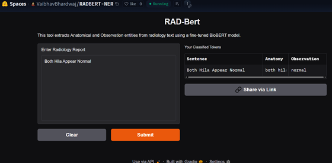

## RAD_BERT ( Radiology NER Assistant using BioBERT )

A lightweight  assistant that extracts **Anatomical Locations**, **Observations**, and optionally **Severity** from free-text radiology reports using a fine-tuned BioBERT model. Deployed using Gradio on Hugging Face Spaces.

---

#### ⭐ Project Summary

#### 1. Problem

Radiology reports are typically written in **unstructured free text**, making it difficult to extract structured clinical information such as anatomical findings and observations. Manual annotation is slow, inconsistent, and costly.

---

#### 2. Task
- Build a Text to speech model using whisper that convert radiology transcription dictation that can be further paired with RAD-Bert.
- Build a **model** to extract:
  - **Anatomical Locations**
  - **Observations**
  - **Severity** (future scope)

- Deploy the model as a **Gradio web app** for real-time, user-friendly access.

---

### 3. Action

#### 🔹 Dataset & Annotation
- Used the **CheXpert** dataset, which contains real radiology reports.
- The dataset was well annotated with all the labelling but it was in json format.
- Converted the Json structured Chexpert to Bio Labelled data.
- **BIO tagging scheme**:
  - `B-ANAT`, `I-ANAT` → Anatomical terms  
  - `B-OBS`, `I-OBS` → Observations  
  - `B-SEV`, `I-SEV` → Severity

#### 🔹 Model Training
- Fine-tuned **BioBERT** (`dmis-lab/biobert-base-cased-v1.1`) using:
  - Hugging Face Transformers
  - PyTorch backend
  - Custom token cleaning logic for subwords

#### 🔹 Web Deployment
- Wrapped the model in a **Gradio app** that:
  - Accepts free-text radiology reports
  - Returns a sentence-wise table of extracted entities
- Hosted using **Hugging Face Spaces**

---

### 🌟 Result

✅ Successfully deployed  that helps:
- Structure clinical narratives
- Accelerate data annotation
- Assist healthcare AI researchers

---

## 🌐 Live Demo 
🧠 Model: [`VaibhavBhardwaj/Radbert`](https://huggingface.co/spaces/VaibhavBhardwaj/RADBERT-NER)

---

## 🛠️ Tech Stack

| Component        | Tool / Library                            |
|------------------|--------------------------------------------|
| Model            | BioBERT (fine-tuned)                      |
| NLP Framework    | Hugging Face Transformers                 |
| Deep Learning    | PyTorch                                   |
| Tokenization     | WordPiece, AutoTokenizer                  |
| Data Labeling    | Manual + BIO tagging                      |
| Web App          | Gradio                                    |
| Hosting          | Hugging Face Spaces                       |
| Data Handling    | pandas                                    |

---

## 💡 Future Scope

- 🔄 **Integrate with radiology reporting tools** to:
  - Auto-tag entities in real-time
  - Assist radiologists with **structured report generation**

- 🔍 Expand entity types:
  - Severity, Laterality, Modality, Temporal descriptors

- 📊 Use NER output for downstream tasks like:
  - Report classification
  - Alert generation
  - Clinical summarization with RAG

---

## 📸 Demo Screenshot

*Add your screenshot or GIF here*


---

## How to run Locally


```bash
git clone https://huggingface.co/spaces/YOUR_USERNAME/RadBERT-NER
cd RadBERT-NER
pip install -r requirements.txt
python app.py

